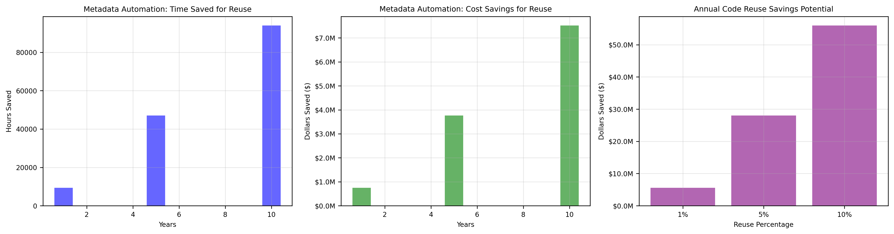

# SHARE IT Act Cost Savings Estimation

Scripts for estimating time and cost savings from OSPO proposed implementation of the SHARE IT Act

## About the Project

The CMS OSPO has created automated metadata generation processes and tooling for the agency's 10,000+ repositories that we estimate can reduce processing time from 1 hour (minimum) to ~10 minutes per repository. 

## Core Team

A list of core team members responsible for the code and documentation in this repository can be found in [COMMUNITY.md](COMMUNITY.md).

### PROCESSES & TOOLING
| Resource | URL |
|----------|-----|
| code.json Docs | https://github.com/DSACMS/gov-codejson |
| code.json webform | https://dsacms.github.io/codejson-generator/ |
| webform source | https://github.com/DSACMS/codejson-generator |
| Automated code.json generator | https://github.com/DSACMS/automated-codejson-generator |


### METHODOLOGY 
```python
# Input variables for metadata automation
total_repositories = 10000
automated_percentage = 0.80
manual_time_minutes = 60  # Original manual time per repo
automated_time_minutes = 2  # Average automated processing time
manual_portion_time_minutes = 10  # Time for manual portion after automation
hourly_rate = 80  # GS-13/14 fully-loaded $100-150/hour. Contractor rates range $125-200/hour.


years_to_project = [1, 5, 10]

# Input variables for hypothetical code reuse
avg_project_cost = 1000000  # $1M per project
num_projects = 100          # Number of new projects per year
reuse_rates = [0.01, 0.05, 0.10]
efficiency_factor = 0.8     # Adjustment for reuse implementation effort

# Input variables for actual code reuse
annual_it_spend = 2800000000  # $2.8B annual IT spending
development_budget = 700000000  # $700M development budget (25%)
reuse_rates = [0.01, 0.05, 0.10]
efficiency_factor = 0.8

```


## ESTIMATED IMPACT
### DISCLAIMER
These rough estimates are for *prospective* work that we expect will need to be done in the future, and do not represent a reduction in current work that is already happening, or a reduction in money that is already being spent.


#### Estimated Metadata Automation Savings
- 94% reduction in processing time
- 9,400 hours saved annually
- $752K saved in year one
- $7.52M saved over 10 years

| Period | Time Saved (Hours) | Cost Savings |
|--------|--------------------|--------------|
| 1 Year | 9,400 | $752,000 |
| 5 Years | 47,000 | $3.76M |
| 10 Years | 94,000 | $7.52M |

#### Hypothetical Code Reuse Potential Savings: `generate_savings_reuse_analysis.py`
- Average Project Cost: $1,000,000
- Number of New Projects per year: 100
- Reuse Implementation Effort: 80%
- Estimate of Annual IT Spend: $100,000,000

| Reuse Rate |  Cost Savings |
|------------|---------------|
| 1% reuse   | $800,000  |
| 5% reuse   | $4,000,000 |
| 10% reuse  | $8,000,000  |
| 25% reuse  | $20,000,000 |
| 50% reuse  | $40,000,000 |

#### Code Reuse Potential Savings: `generate_savings_reuse_analysis_real.py`

Based on publicly available information, CMS's annual IT spending is approximately $2.8 billion (FY2023). This includes both internal systems and contractor-operated systems.


Breaking this down further:
- Major IT investments: ~$2.3 billion
- Operations and maintenance: ~$2.1 billion
- Development, modernization, and enhancement: ~$700 million

Based on the reported $700,000,000 DME budget:

| Reuse Rate |  Cost Savings |
|------------|---------------|
| 1% reuse   | $5,600,000  |
| 5% reuse   | $28,000,000 |
| 10% reuse  | $56,000,000  |
| 25% reuse  | $140,000,000 |
| 50% reuse  | $280,000,000 |

##### Budgetary Data Sources
- https://www.usaspending.gov/agency/centers-for-medicare-and-medicaid-services
- https://www.cms.gov/about-cms/agency-information/performance/budget-and-performance
- https://www.itdashboard.gov/
- https://oversight.house.gov/fitara


### Visualization of Savings based on 10K Repos and $700M Annual DME Spend



## Installation
To run the analysis and generate graphs, install the required dependencies:

    pip install -r requirements.txt

## Usage

    python generate_savings_reuse_analysis.py


This will generate both the analysis and save the visualization graphs as PNG files.

## Requirements

The following dependencies are needed to run the script. They are listed in `requirements.txt`:

    matplotlib>=3.7.1
    numpy>=1.24.3

## Contributing
Contributions are welcome! Please feel free to submit Issues and/or Pull Requests: https://github.cms.gov/ospo/shareitsavings

## Policies

### Open Source Policy

We adhere to the [CMS Open Source
Policy](https://github.com/CMSGov/cms-open-source-policy). If you have any
questions, just [shoot us an email](mailto:opensource@cms.hhs.gov).

### Security and Responsible Disclosure Policy

_Submit a vulnerability:_ Vulnerability reports can be submitted through [Bugcrowd](https://bugcrowd.com/cms-vdp). Reports may be submitted anonymously. If you share contact information, we will acknowledge receipt of your report within 3 business days.

For more information about our Security, Vulnerability, and Responsible Disclosure Policies, see [SECURITY.md](SECURITY.md).

### Software Bill of Materials (SBOM)

A Software Bill of Materials (SBOM) is a formal record containing the details and supply chain relationships of various components used in building software.

In the spirit of [Executive Order 14028 - Improving the Nation’s Cyber Security](https://www.gsa.gov/technology/it-contract-vehicles-and-purchasing-programs/information-technology-category/it-security/executive-order-14028), a SBOM for this repository is provided here: https://github.com/DSACMS/share-it-savings/network/dependencies.

For more information and resources about SBOMs, visit: https://www.cisa.gov/sbom.

## Public domain

This project is in the public domain within the United States, and copyright and related rights in the work worldwide are waived through the [CC0 1.0 Universal public domain dedication](https://creativecommons.org/publicdomain/zero/1.0/) as indicated in [LICENSE](LICENSE).

All contributions to this project will be released under the CC0 dedication. By submitting a pull request or issue, you are agreeing to comply with this waiver of copyright interest.
